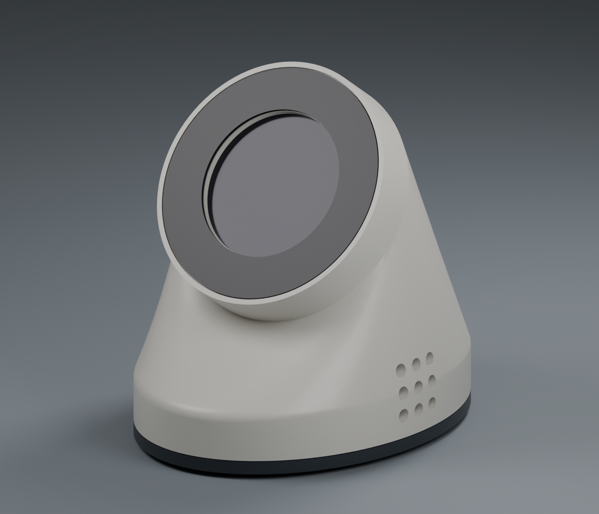
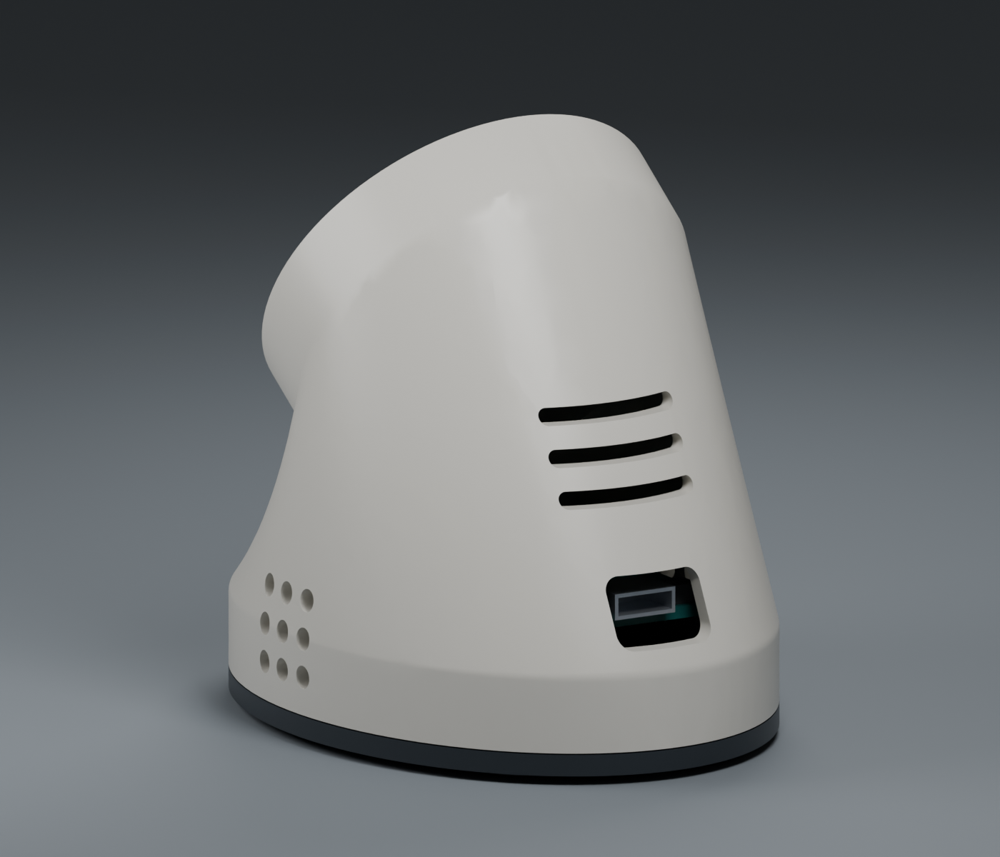
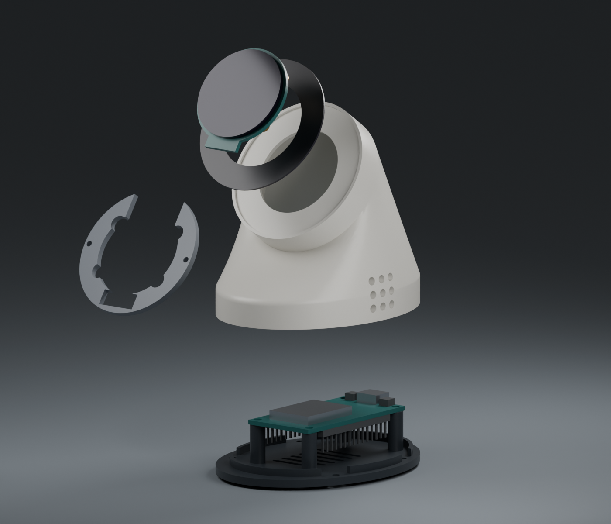
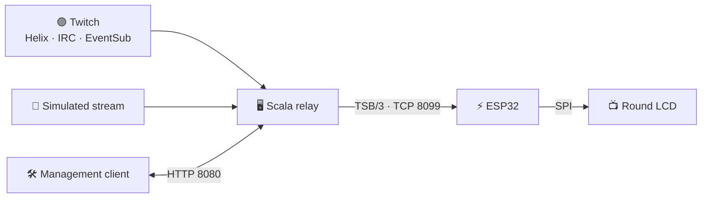

<div align="center">

<p>🟣 STREAM CULTURE. TINY HARDWARE. BIG DESK ENERGY.</p>
<h1>✨ Twitch Screen</h1>
<p><strong>Your stream’s tiny desk bestie.</strong><br>
Live stats, little celebrations, and a front-row seat to the chaos.</p>

<p>
  <a href="https://github.com/worxbend/twitch-screen/actions/workflows/ci.yml"></a>
  
  
  
  
</p>

<p>
  <a href="docs/README.md"><strong>📖 Guidebook</strong></a> ·
  <a href="docs/guides/first-simulated-stream.md">🚀 Try the demo</a> ·
  <a href="docs/guides/device-build.md">🛠️ Build one</a> ·
  <a href="docs/guides/twitch-app-setup.md">🔗 Connect Twitch</a> ·
  <a href="CONTRIBUTING.md">💜 Contribute</a>
</p>

<a href="twitch-screen-cad-design/output/preview/01_front_hero.png">
  
</a>
<p><sub>Actual enclosure CAD render · screen shown unpowered · physical fit still needs validation</sub></p>

</div>

**Twitch Screen is a DIY ESP32 desk display that brings your Twitch stream into the physical world.** A 240 × 240 round LCD shows live viewers, uptime, followers, subscribers, and chat activity. Follow, sub, gift, raid, and bits events get their own animated notification cards. A Scala relay does the Twitch work; a printable little pod gives it a home. 🏡

Start with a simulated stream on your computer. Add the display when you’re ready. Connect your own Twitch channel after that. The full path is in the **[guidebook](docs/README.md)**.

## 👀 Small screen. Main-character energy.

| On your desk | Under the hood |
| :--- | :--- |
| 📊 **Stats at a glance** — live/offline state, audience totals, uptime, and a chat activity ring | LVGL 9 UI on a GC9A01 round LCD |
| 🎉 **A little celebration** — cards for follows, subs, gifts, bits, and raids | Twitch Helix, anonymous IRC, and EventSub feed the relay |
| 🧪 **No stream? Still a vibe.** — try a scripted audience without Twitch credentials | The real relay runs in `simulated` mode |
| 🔌 **Reconnect and carry on** — bounded replay helps recover recent notifications | Binary TSB/3 over one persistent TCP connection; replay lives in memory |
| 🖨️ **Print your desk buddy** — curved shell, dark base, rear USB-C | Four printable parts; editable FreeCAD, STEP, STL, and 3MF files included |
| 🛠️ **Make it yours** — inspect devices, disconnect a session, send test cards | Authenticated HTTP management API with Swagger UI |

Chat cards are hidden by default; chat still contributes to activity stats. No touch controls or on-device setup menu are implemented. Configure Wi-Fi and the relay address before flashing.

## 🧭 Pick your side quest

| You’re here to… | Start here | You’ll end up with… |
| :--- | :--- | :--- |
| **See what it does** 👋 | [First simulated stream](docs/guides/first-simulated-stream.md) | A working relay and observable events; no hardware or Twitch account needed |
| **Build the whole thing** 🔧 | [Parts, wiring & assembly](docs/guides/device-build.md) | A measured, wired, printed device ready for firmware |
| **Flash an ESP32** ⚡ | [Firmware setup](docs/guides/firmware-setup.md) | Wi-Fi, a relay address, and firmware on your board |
| **Use a real channel** 🟣 | [Twitch app setup](docs/guides/twitch-app-setup.md) | A registered app and broadcaster authorization |
| **Host the backend** 🖥️ | [Relay setup](docs/guides/relay-setup.md) | A configured local or Docker service with persistent tokens |
| **Use an assembled device** ☕ | [Everyday use](docs/guides/device-use.md) | An understanding of the screen, cards, and reconnect behavior |
| **Hack on the project** 🧑‍💻 | [Developer guide](docs/guides/development.md) | The toolchains, checks, source map, and contribution path |

## 🚀 First run: summon the pretend chat

You need Git, a POSIX shell (Linux, macOS, or WSL), `curl`, OpenSSL, and JDK 25 on your `PATH` for this setup. The included Mill launcher downloads its pinned tooling and Temurin JDK; older Linux systems use a JVM launcher that needs an existing Java installation to bootstrap. Follow the [Java setup notes](docs/guides/development.md#checkout-and-prerequisites) and allow network access and time for the initial build.

Run this in a terminal:

```sh
git clone https://github.com/worxbend/twitch-screen.git
cd twitch-screen/twitch-screen-relay
export RELAY_HTTP_AUTH_API_TOKEN="$(openssl rand -hex 32)"
RELAY_HTTP_HOST=127.0.0.1 RELAY_DEVICE_HOST=127.0.0.1 \
  RELAY_TWITCH_MODE=simulated ./mill run
```

Keep that terminal open. The generated token protects management routes, including in simulation. In a second terminal:

```sh
curl --fail http://localhost:8080/api/v1/health
curl --fail http://localhost:8080/api/v1/stats
```

Health returns `{"status":"Up"}`. Stats change as the simulator runs; allow around 30 seconds for the first audience telemetry snapshot. Open **[Swagger UI](http://localhost:8080/docs)** to explore the API. Public health and aggregate stats work without a token; management actions require authentication.

**🎯 First win unlocked:** the backend runs without Twitch credentials or an ESP32. Follow the [annotated tutorial](docs/guides/first-simulated-stream.md) for protected requests and a test notification. Stop the relay with **Ctrl+C**.

To connect real hardware, follow [relay setup](docs/guides/relay-setup.md) to listen on a trusted LAN interface, then [configure and flash the firmware](docs/guides/firmware-setup.md). The quick start above listens only on your computer.

## 🏡 Meet the pod

<table>
  <tr>
    <td align="center" width="50%"><a href="twitch-screen-cad-design/output/preview/02_rear_usb.png"></a><br><strong>Business in the back 🔌</strong><br><sub>Rear USB-C and a removable base</sub></td>
    <td align="center" width="50%"><a href="twitch-screen-cad-design/output/preview/06_exploded.png"></a><br><strong>Some assembly, much personality 🧩</strong><br><sub>Four printed parts around two boards</sub></td>
  </tr>
</table>

The nominal enclosure is **64 × 86 × 78.1 mm** before feet, with a **55° face tilt**. It targets a **30-pin ESP32 DevKit V1 Type-C** and **Waveshare 1.28inch LCD Module**. Clone boards vary: use the [measurement checklist](twitch-screen-cad-design/docs/measurement_checklist.md) before printing. Renders and automated geometry checks establish the design; a physical build must confirm fit and tolerances.

**[🖨️ Print plate](twitch-screen-cad-design/output/3mf/print_plate.3mf)** · **[📐 Editable CAD](twitch-screen-cad-design/output/freecad/TwitchScreen.FCStd)** · **[🔍 Cutaway render](twitch-screen-cad-design/output/preview/05_section.png)** · **[🛠️ Full build guide](docs/guides/device-build.md)**

## 🧠 How the magic gets to your desk



The relay manages Twitch authorization, gathers events and stats, and pushes compact binary frames to the screen. The ESP32 manages Wi-Fi, the connection, and the UI. Live mode uses EventSub WebSocket by default, so a public webhook endpoint is unnecessary. Read the [architecture guide](docs/reference/architecture.md) for the event flow and trade-offs.

The device connection is **plain TCP without device authentication**. Keep port 8099 on a trusted LAN or private network; do not expose it directly to the internet. Remote management needs HTTPS in front of the relay. [Deployment details →](docs/guides/relay-setup.md)

## 🗂️ One repo, three workbenches

| Directory | What lives here | Tools |
| :--- | :--- | :--- |
| [`twitch-screen-relay/`](twitch-screen-relay/README.md) | Twitch integration, device server, HTTP API | Scala 3 · Mill · JDK 25 |
| [`twitch-screen-firmware/`](twitch-screen-firmware/README.md) | ESP32 firmware, UI assets, TSB/3 implementation | PlatformIO · Arduino · TFT_eSPI · LVGL 9 |
| [`twitch-screen-cad-design/`](twitch-screen-cad-design/README.md) | Parametric enclosure, print files, renders | FreeCAD · Blender |
| [`docs/`](docs/README.md) | Tutorials, setup guides, configuration and API references | GitHub Markdown |

Run each project’s commands from its own directory. There is no shared root build. The old Python demo server has been removed: its NDJSON v2 format is incompatible with the current TSB/3 firmware. Use the [Scala simulator](docs/guides/first-simulated-stream.md).

## 🧰 Commands you’ll actually use

| Working directory | Command | Purpose |
| :--- | :--- | :--- |
| `twitch-screen-relay` | `./mill test` | Relay tests |
| `twitch-screen-relay` | `./mill mill.scalalib.scalafmt/checkFormatAll` | Scala formatting check |
| `twitch-screen-relay` | `docker compose up --build` | Run the simulated relay in Docker; set management credentials first |
| `twitch-screen-firmware` | `pio run -e esp32dev` | Build firmware after creating `src/credentials.h` |
| `twitch-screen-firmware` | `pio run -e esp32dev -t upload --upload-port /dev/ttyUSB0` | Flash your board; replace the example port |
| `twitch-screen-firmware` | `pio test -e native` | Host protocol/session tests |
| Repository root | `python3 tools/check_protocol_vectors.py` | Check shared protocol vectors |

Tool installation, credentials, serial-port selection, sanitizers, containers, and CAD commands are covered in the [developer guide](docs/guides/development.md) and [guidebook](docs/README.md).

## 💜 Build with us

Found a weird pixel? A confusing setup step? A better way to mount the board? Contributions are welcome. Read **[CONTRIBUTING.md](CONTRIBUTING.md)**, run the relevant checks, and include what you observed. Hardware reports are especially useful with board measurements and photos.

[GitHub Actions](.github/workflows/ci.yml) covers relay compilation, tests, formatting and dependency auditing; firmware native/sanitizer tests and compilation; protocol vectors; CAD script syntax; and container build/smoke checks. Physical display behavior, live Twitch authorization, and printed fit need separate validation. Existing [review findings](tasks/review-status.md) and [verification evidence](tasks/review-judge.md) document those boundaries. Temporary [dependency audit exceptions](tasks/review-dependencies.md) expire on **2026-10-25**.

**Stuck?** Start with [troubleshooting](docs/guides/troubleshooting.md), then [open an issue](https://github.com/worxbend/twitch-screen/issues). Remove tokens, Wi-Fi passwords, and personal data from logs first.

**Project notes:** this is an independent DIY project, not an official Twitch product. No `LICENSE` file is currently checked in.

<div align="center">
<hr>
<p><strong>Made for the “one more stream” crowd. 🌙</strong><br>
<sub>May your packets arrive and your first layer stick.</sub></p>
</div>
