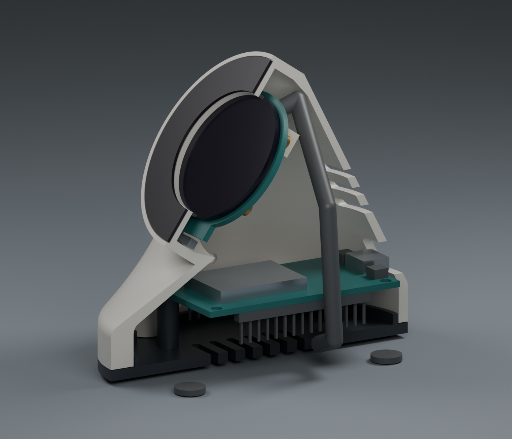

# 🛠️ Build your desk companion

[← Guidebook](../README.md) · [Firmware setup →](firmware-setup.md)

This guide takes you from loose boards to a wired, enclosed Twitch screen. Start with the electronics on your desk, prove the display works, then commit to the enclosure. Tiny screen, excellent main-character energy. ✨

**Build status:** the enclosure is a complete nominal CAD design with exported meshes and validation reports. Its print settings, clone-board dimensions and physical fit still need validation on your actual hardware. The renders below show the CAD model; they are not photographs of a finished print.

## 1. Gather the parts

### Electronics and tools

| Quantity | Part | Match these details |
| --- | --- | --- |
| 1 | ESP32 DevKit V1 Type-C | Classic ESP32/WROOM-32, **30-pin**, two header rows and four mounting holes; compare your board to the [hardware references](../../twitch-screen-cad-design/refs/hardware/) |
| 1 | Waveshare 1.28inch LCD Module | **Non-touch**, 240 × 240, GC9A01, eight-pin SPI connector |
| 1 | Eight-wire LCD cable/loom | Supplied module cable with connections compatible with your ESP32 headers |
| 1 | USB data cable | USB-C at the board end; must carry data for flashing |
| 1 | USB power source | A computer for upload; a suitable USB power supply for desk use |
| 1 | Relay computer | Runs the backend and stays reachable from the ESP32 over the local network |
| — | Basic tools | Calipers, small screwdrivers, flush cutters/support-removal tools, a slicer and access to a 3D printer |

The [Waveshare product page](https://www.waveshare.com/1.28inch-LCD-Module.htm) identifies the intended GC9A01 module and provides the outline drawing. The visible display is 32.4 mm across; the PCB is 37.5 mm wide and 40.4 mm overall with its tab. Similar-looking touch modules and integrated ESP32 display boards use different layouts.

The ESP32 name alone does not establish enclosure compatibility. USB connector position, header depth, hole spacing and PCB outline vary between clones. Use the [measurement checklist](../../twitch-screen-cad-design/docs/measurement_checklist.md) before buying a substitute or printing the complete shell.

### Enclosure hardware

| Quantity | Part | Design assumption |
| --- | --- | --- |
| 1 each | Shell, base, LCD retainer, face bezel | Four printed parts; a dark face bezel gives the render's contrasting front |
| 4 | M2 × 6 mm pan-head screws | ESP32 mounting; nominal head diameter 3.8 mm |
| 4 | M2.5 × 8 mm low-profile pan-head screws | Base closure; head recesses are 5.2 mm diameter × 1.3 mm deep |
| 2 | M2 × 5 mm pan-head screws | LCD retainer to shell |
| 4 | Adhesive rubber feet | 8 mm diameter × approximately 1.5 mm thick |
| — | Double-sided adhesive film | Approximately 0.15 mm thick for the face insert; compatible with the filament |

These screws form threads in the printed pilot holes. The design does not assume heat-set inserts or a particular thread in the LCD's brass mounts. Test the pilot fit in a small printed coupon first.

## 2. Wire the display

Disconnect USB power before changing wires. Follow the **pin labels**, rather than cable colors: a replacement loom may use a different color order.

| LCD pin | ESP32 board label | GPIO / purpose |
| --- | --- | --- |
| VCC | **3V3** | Module power |
| GND | **GND** | Common ground |
| DIN | **D23** | GPIO 23, SPI data/MOSI |
| CLK | **D18** | GPIO 18, SPI clock |
| CS | **D5** | GPIO 5, chip select |
| DC | **RX2** | GPIO 16, data/command |
| RST | **D4** | GPIO 4, display reset |
| BL | **D15** | GPIO 15, backlight |

On the referenced DevKit, `D23` means GPIO 23 and `RX2` means GPIO 16. **RX2 is a GPIO label here; do not substitute RX0.** The firmware owns GPIO 16 as the LCD data/command signal.

Use the project's 3.3 V wiring even though Waveshare also lists a 5 V module supply option. The eight connections above match [platformio.ini](../../twitch-screen-firmware/platformio.ini) and the wiring comment in [main.cpp](../../twitch-screen-firmware/src/main.cpp). There is no MISO connection or touch-controller wiring in this build.

Keep the SPI wires short and make sure each jumper seats fully. The configured SPI clock is 40 MHz. The firmware drives BL high continuously; day/night dimming is not implemented.

## 3. Prove the electronics before printing

Follow [firmware setup](firmware-setup.md), including its **LAN-reachable simulated relay** startup before the first boot. The separate [simulated-stream tutorial](first-simulated-stream.md) is a local learning exercise: stop its loopback-only instance before starting the device's relay. Keep the boards on a nonconductive surface with their undersides clear of loose screws.

Before proceeding, observe:

- A powered screen with a purple connecting animation.
- A working relay connection followed by live/offline telemetry.
- A simulated notification with readable text and the expected color.
- Stable USB power and no reset loop.

This separates a wiring or network problem from a fit problem. Enclosure assembly becomes much easier once you know the electronics work.

## 4. Measure your boards

The nominal enclosure is approximately **64 × 86 × 78.1 mm**, before feet, with its display face tilted **55° from horizontal**. These are assembly dimensions, not the rotated print footprint.

Record your own measurements in a working copy of the [measurement checklist](../../twitch-screen-cad-design/docs/measurement_checklist.md). Pay particular attention to:

- ESP32 outline, four-hole pattern and the height of plugged-in female headers.
- USB socket position and your cable's complete plastic overmould.
- LCD glass thickness, PCB thickness and connector projection with its cable attached.
- The LCD's four brass mounts; the retainer clears them rather than fastening into them.
- Wire bend space and the service loop needed to lower the removable base.

The nominal ESP32 PCB is 55 × 28 × 1.6 mm, with a 24 × 49 mm hole pattern. These values are provisional clone-board assumptions, not a universal DevKit specification.

Update [parameters.json](../../twitch-screen-cad-design/parameters.json) for differences and follow the [CAD rebuild instructions](../../twitch-screen-cad-design/README.md#rebuild-and-verify). Changing a saved FreeCAD document alone does not regenerate the committed STL or 3MF exports.

## 5. Choose and slice the printable files

| Want to print… | Open this |
| --- | --- |
| All four parts on one plate | [print_plate.3mf](../../twitch-screen-cad-design/output/3mf/print_plate.3mf) |
| Main housing | [shell.stl](../../twitch-screen-cad-design/output/stl/shell.stl) |
| Removable underside | [base.stl](../../twitch-screen-cad-design/output/stl/base.stl) |
| LCD retaining ring | [lcd_retainer.stl](../../twitch-screen-cad-design/output/stl/lcd_retainer.stl) |
| Dark front insert | [face_bezel.stl](../../twitch-screen-cad-design/output/stl/face_bezel.stl) |

Individual printable STL and 3MF files already sit on Z = 0 in their intended print orientation. Files named **`assembly_view_only` contain electronics reference bodies and must not be used as print plates**.

The supplied plate occupies approximately **197 × 151 mm**, before brim and support expansion. Check it against your actual bed and slicer margins. Printing parts individually is useful for a smaller bed, separate colors and early fit checks.

### Starting slicer settings

| Setting | Starting point |
| --- | --- |
| Material | PETG |
| Nozzle | 0.4 mm |
| Layer height | 0.2 mm |
| Perimeters | 4 |
| Top/bottom layers | 5 |
| Infill | 20–30% |
| Shell | Face down as exported; inspect supports for internal bosses and USB roof |
| Base | Underside down; posts up |
| Retainer and bezel | Flat as exported |

**This is a starting profile, not a tested print recipe.** Inspect every layer around the LCD seat, posts, vents and rear USB opening. Keep support contact away from the glass seat. A brim may help the shell's narrow first-layer annulus.

Print the base first to check the ESP32 hole pattern. Confirm screw-pilot fit and bezel/glass clearance before committing to the complete enclosure.

## 6. Assemble the enclosure

With power disconnected:

1. Remove supports and loose strands. Check that ventilation slots, locating surfaces and the USB opening are clear.
2. Attach the dark face insert inside the front rim with approximately 0.15 mm adhesive film. Keep adhesive outside the display opening.
3. Remove the display's protective film. Insert the LCD from inside, **tab down and rear connector up**. Check that no printed edge loads the active glass surface.
4. Fit the retainer behind the PCB, matching its connector notch and tab relief. Tighten the two M2 × 5 mm screws lightly and evenly. The retainer holds the PCB perimeter.
5. Mount the ESP32 on the four base posts with the M2 × 6 mm screws. Its **USB-C connector faces the rear**; its PCB antenna faces the front.
6. Reconnect the loom using the wiring table. Route it through the side cavity, away from the glass, screw posts and antenna. Leave enough slack to lower the base before unplugging it.
7. Seat the base locating lip and secure the four M2.5 × 8 mm screws from underneath. Stop if the joint requires force; find the obstruction first.
8. Test USB cable insertion from the rear, then attach the four rubber feet.

The rounded cable body in the render represents a 4.4 mm routing corridor for the eight-wire loom. It does not show individual electrical connections.

## 7. Give it a desk spot

Connect USB, keep the relay running, and repeat the simulated display check after closing the case. Confirm the cable fits without pushing on the PCB and that ventilation remains clear.

EN and BOOT are service buttons on the ESP32 board; access requires removing the base. There are no external screen controls. For daily operation, continue to [using the device](device-use.md). For real channel events, follow [Twitch app setup](twitch-app-setup.md) and [relay setup](relay-setup.md).

## Evidence and design files

- [CAD overview and reproducible export commands](../../twitch-screen-cad-design/README.md)
- [Hardware measurement checklist](../../twitch-screen-cad-design/docs/measurement_checklist.md)
- [Nominal geometry, mesh, assembly and wall reports](../../twitch-screen-cad-design/output/reports/)
- [Mechanical completion audit and its limits](../../twitch-screen-cad-design/docs/completion_audit.md)
- [Troubleshooting](troubleshooting.md)
