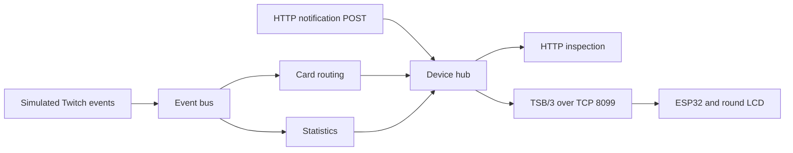

# Your first simulated stream

Welcome! This tutorial is for someone who can run commands in a terminal and wants to understand what the relay does before wiring a display or registering a Twitch application. You do not need an ESP32, Twitch account, Docker, or Scala knowledge.

By the end, you will understand how to:

- Start a local stream simulation without Twitch credentials.
- Distinguish public health information from protected management information.
- Observe the difference between stream statistics and notification cards.
- Publish a card and identify where an ESP32 joins the pipeline.

We will start the relay, inspect it, watch its figures change, send a card, and stop it. Read from top to bottom. You will use one terminal for the relay and a second for requests.

## Before you start

Use a Linux or macOS terminal with Git, `curl`, OpenSSL, Python 3, and JDK 25 available on `PATH`. Follow [Adoptium's installation guide](https://adoptium.net/installation) to install Java, then check the selected version:

```sh
java -version
```

- `java -version` reports the Java runtime selected by this terminal. Confirm that the reported major version is **25** before continuing.

The bundled launcher downloads Mill 1.1.9 and the configured Temurin JDK 25; on older Linux systems it uses a JVM launcher that needs an existing Java installation to bootstrap. Allow internet access and time for the first toolchain and dependency downloads. Ports 8080 and 8099 must be free on this machine.

This walkthrough uses the repository defaults except for binding both listeners to your own computer. It creates an ignored `.env.tutorial` file in the relay directory for a temporary management token.

## Get the checkout

The existing relay is the runnable example; no separate Scala example module is needed. Start a fresh checkout in **terminal 1**:

```sh
git clone https://github.com/worxbend/twitch-screen.git
cd twitch-screen/twitch-screen-relay
```

- `git clone` downloads the project into `twitch-screen`.
- `cd` goes straight into the relay module where the tutorial commands run. An existing checkout can begin at this same directory.

The [development guide](development.md) lists the build and verification commands for this example and the existing [container smoke companion](../../tools/smoke_container.py).

## 1. Start the source of events

The relay normally takes observations from Twitch. In `simulated` mode, a fixed script supplies those observations to the same downstream code. Let's start it in terminal 1 and leave it running.

```sh
test -f .env.tutorial || (umask 077; openssl rand -hex 32 > .env.tutorial)
export RELAY_HTTP_AUTH_API_TOKEN="$(cat .env.tutorial)"
RELAY_HTTP_HOST=127.0.0.1 RELAY_DEVICE_HOST=127.0.0.1 \
  RELAY_TWITCH_MODE=simulated ./mill --no-server run
```

- `test` preserves a token file from an earlier tutorial run. When it is absent, the parenthesized command creates a random token with owner-only permissions; `umask` applies only inside those parentheses.
- `export` reads that token into the shell environment for the relay. It is separate from a Twitch token. The file contains only the token, and its contents are not executed as shell commands.
- `RELAY_HTTP_HOST` and `RELAY_DEVICE_HOST` bind the HTTP and device listeners to loopback for this local exercise.
- `RELAY_TWITCH_MODE=simulated` selects the scripted source. `./mill --no-server run` starts the application without a persistent Mill server and displays its logs in this terminal.

Look for log messages containing:

```text
Simulating Twitch for 'simulated-channel': an audience event every 12 seconds
Device link listening on 127.0.0.1:8099 (protocol v3, max 64 sessions)
Management API on http://127.0.0.1:8080/docs
```

Timestamps, thread names, and the API's endpoint count surround these messages. A download or compilation phase may precede them. A configuration error or `Address already in use` means startup has failed; resolve the message using [troubleshooting](troubleshooting.md) before continuing. Missing management credentials are a startup error even in simulated mode.

## 2. Ask whether the relay is running

Health tells you that the process can serve HTTP. Status tells you what the relay is doing, and requires the management token. Open **terminal 2**, navigate to this checkout's `twitch-screen-relay` directory, and read the same temporary credential:

```sh
export RELAY_HTTP_AUTH_API_TOKEN="$(cat .env.tutorial)"
```

- `export` reads the token created in terminal 1. Shell variables are not shared between terminals, so this step gives the request client the same credential as the relay.

Keep terminal 2 in that directory for the remaining HTTP steps:

```sh
curl -fsS http://127.0.0.1:8080/api/v1/health
curl -sS -i http://127.0.0.1:8080/api/v1/status
curl -fsS -H "Authorization: Bearer $RELAY_HTTP_AUTH_API_TOKEN" \
  http://127.0.0.1:8080/api/v1/status | python3 -m json.tool
```

- The first request reads public liveness information. `-f` makes HTTP errors fail the command; `-sS` hides progress while keeping error messages.
- The second request deliberately omits credentials. `-i` includes the response headers so you can see its HTTP status.
- The third request supplies the token in the `Authorization` header. The continuation line selects the endpoint, and `python3 -m json.tool` formats its JSON response.

The health response is `{"status":"Up"}`. The request without credentials returns **401** with `{"error":"Invalid management credentials"}`. The authenticated response returns **200**, with `twitch.mode` equal to `Simulated`, `twitch.health` equal to `Connected`, and `deviceLink.connectedDevices` equal to `0`.

Notice that `Connected` describes the simulated source. The detail says `synthetic events, no Twitch connection`; no contact with Twitch is needed. A healthy relay can also have no connected screens.

## 3. Watch the stream figures change

Statistics describe the stream now. The simulator begins in a live state, then periodically supplies totals; the relay publishes the resulting snapshot every five seconds.

```sh
curl -fsS http://127.0.0.1:8080/api/v1/stats | python3 -m json.tool
sleep 35
curl -fsS http://127.0.0.1:8080/api/v1/stats | python3 -m json.tool
```

- The first line reads the public statistics summary and formats it.
- `sleep 35` allows a 30-second simulated totals update and the regular statistics broadcast to occur.
- The final line reads the newer snapshot from the same endpoint.

Immediately after startup, `state` is `Live` but viewer, follower, and subscriber totals are zero. After the first telemetry update, the totals are `120`, `12400`, and `318`. Later updates move through a fixed pattern, so the values depend on how long you have spent reading. `uptimeSeconds` also jumps to a simulated stream age of about 12 minutes on the first totals update; it is not the relay process uptime.

`chatRate` rises as simulated messages arrive every two seconds. This HTTP summary includes state, viewers, followers, subscribers, uptime, and chat rate. The binary `STATS` message also carries the cumulative message count used by the display.

## 4. Read and create notification cards

A notification records something that happened. It has a sequence number and a display duration, while statistics are a replaceable snapshot. Let's inspect the retained notifications and publish one ourselves.

```sh
curl -fsS -H "Authorization: Bearer $RELAY_HTTP_AUTH_API_TOKEN" \
  'http://127.0.0.1:8080/api/v1/notifications?pageSize=5' | python3 -m json.tool
curl -fsS -H "Authorization: Bearer $RELAY_HTTP_AUTH_API_TOKEN" \
  -H 'Content-Type: application/json' \
  -d '{"type":"info","title":"Hello round display","body":"This card came through HTTP","ttlMs":8000}' \
  http://127.0.0.1:8080/api/v1/notifications | python3 -m json.tool
```

- The first request authenticates and reads the five most recent retained notifications. `pageSize` is the query parameter; the quotes preserve the URL as one shell argument.
- The next request uses the same authorization header.
- `Content-Type` identifies the request body as JSON.
- `-d` selects POST and supplies an `info` card with an eight-second display duration.
- The final line selects the notification endpoint and formats the response.

The list contains a `notifications` array, newest first. Over time, the audience script produces `pixelpainter` following, `nightowl` subscribing, `bitbaron` cheering bits, `generouspanda` gifting subscriptions, `streamfriend` raiding, and `quietlurker` following. The seventh audience tick is a Nightbot message that the default bot filter removes. The script then repeats. It also emits a stream-start event at startup; it does not simulate stream endings.

Your POST returns a record with an assigned `seq`, an `id` such as `ntf-0023`, the supplied text, and `ttlMs: 8000`. The sequence and timestamp vary. Sending the POST again creates another card; this API does not deduplicate retries.

You will also see `chat` records even though the default `RELAY_CHAT_NOTIFICATIONS` policy is `hide`. The relay sequences and retains human chat, and counts it in statistics, before deciding whether to send chat cards to a device. The Nightbot line is filtered earlier, so it contributes neither a card nor a chat count.

## 5. Putting it together

Both the simulator and your HTTP request have reached the relay's notification hub. Now inspect the last boundary: the attached devices.

```sh
curl -fsS -H "Authorization: Bearer $RELAY_HTTP_AUTH_API_TOKEN" \
  http://127.0.0.1:8080/api/v1/devices | python3 -m json.tool
```

- The first line supplies management authorization.
- The second line reads the current device connections and formats the response.

The result is `{"devices":[]}`. The successful POST proves that the relay accepted and retained your card. It does not prove that a physical screen received or displayed it.



An ESP32 initiates a persistent TCP connection to port 8099. The relay sends binary `EVENT` and `STATS` frames there; the firmware does not poll this HTTP API. This tutorial bound that listener to loopback. The [firmware setup guide](firmware-setup.md) explains the LAN address and listener settings for a physical device.

The complete runnable example is the existing relay in simulated mode, which you have just exercised from source through its HTTP boundary. Its companion implementation is [SimulatedTwitchSource.scala](../../twitch-screen-relay/src/twitchscreen/relay/twitch/SimulatedTwitchSource.scala). The existing [container smoke script](../../tools/smoke_container.py) extends automated verification through a real TSB/3 handshake and shutdown; its run commands are in the [development guide](development.md#container-checks).

### Running the examples

<details>
<summary>Complete two-terminal workflow</summary>

This is the same workflow in one place. To replay it from scratch, stop the earlier relay first and begin in a parent directory without an existing `twitch-screen` checkout. Keep terminal 1 running after the final command:

```sh
git clone https://github.com/worxbend/twitch-screen.git
cd twitch-screen/twitch-screen-relay
test -f .env.tutorial || (umask 077; openssl rand -hex 32 > .env.tutorial)
export RELAY_HTTP_AUTH_API_TOKEN="$(cat .env.tutorial)"
RELAY_HTTP_HOST=127.0.0.1 RELAY_DEVICE_HOST=127.0.0.1 \
  RELAY_TWITCH_MODE=simulated ./mill --no-server run
```

- `git clone` creates the checkout; `cd` enters the runnable relay module directly.
- `test` preserves an existing tutorial token; the parenthesized command creates a private random token when absent.
- `export` loads that token for the relay.
- The final two lines bind both listeners to loopback and start the simulated source in the foreground.

Wait for the management startup message. Open terminal 2 in the same parent directory where you cloned the repository, then run:

```sh
cd twitch-screen/twitch-screen-relay
export RELAY_HTTP_AUTH_API_TOKEN="$(cat .env.tutorial)"
curl -fsS http://127.0.0.1:8080/api/v1/health
curl -sS -i http://127.0.0.1:8080/api/v1/status
curl -fsS -H "Authorization: Bearer $RELAY_HTTP_AUTH_API_TOKEN" \
  http://127.0.0.1:8080/api/v1/status | python3 -m json.tool
curl -fsS http://127.0.0.1:8080/api/v1/stats | python3 -m json.tool
sleep 35
curl -fsS http://127.0.0.1:8080/api/v1/stats | python3 -m json.tool
curl -fsS -H "Authorization: Bearer $RELAY_HTTP_AUTH_API_TOKEN" \
  'http://127.0.0.1:8080/api/v1/notifications?pageSize=5' | python3 -m json.tool
curl -fsS -H "Authorization: Bearer $RELAY_HTTP_AUTH_API_TOKEN" \
  -H 'Content-Type: application/json' \
  -d '{"type":"info","title":"Hello round display","body":"This card came through HTTP","ttlMs":8000}' \
  http://127.0.0.1:8080/api/v1/notifications | python3 -m json.tool
curl -fsS -H "Authorization: Bearer $RELAY_HTTP_AUTH_API_TOKEN" \
  http://127.0.0.1:8080/api/v1/devices | python3 -m json.tool
```

- `cd` selects the same module; `export` gives this second terminal the server's token.
- The health request checks public liveness. The first status request deliberately omits authentication; the second supplies the Bearer token.
- The two statistics requests surround a 35-second observation interval.
- The first notification request lists recent records. The second authenticates, declares JSON, posts an eight-second info card, and formats its assigned record.
- The final request inspects connected devices. Each `python3 -m json.tool` formats the preceding JSON response.

Expect public health `Up`, unauthenticated status `401`, authenticated status `200`, changing simulated statistics, a newly assigned notification sequence, and an empty device list. No physical screen is required. Finish with the next section's Ctrl+C and token cleanup steps.

</details>

## 6. Stop the simulation and understand reset

The relay's recent cards, statistics, activity, and alerts live in memory. Press **Ctrl+C in terminal 1** and wait for the relay to exit. Then clear that terminal's credential:

```sh
unset RELAY_HTTP_AUTH_API_TOKEN
```

- `unset` removes the temporary credential from terminal 1 after the relay stops.

In terminal 2, remove the tutorial credential file and clear its copy of the token:

```sh
rm .env.tutorial
unset RELAY_HTTP_AUTH_API_TOKEN
```

- `rm` removes the temporary token file used by this walkthrough.
- `unset` removes the token from terminal 2's environment.

The listeners close. Restarting the simulator starts its scripts, counters, and in-memory history again; there is no reset HTTP endpoint.

A device reconnecting during the same relay run can request a finite replay of retained events. A freshly booted device starts from the current sequence and does not receive an old backlog. The replay buffer is not durable storage and does not guarantee recovery after a relay restart. The [architecture reference](../reference/architecture.md#reconnects-and-delivery-limits) explains these boundaries.

## What you've learned

You have:

- Run the simulated source without Twitch credentials or hardware.
- Used public health and statistics endpoints and authenticated management requests.
- Distinguished changing stream snapshots from sequenced notification cards.
- Published a card and located the TSB/3 connection that delivers it to an ESP32.

## Where to go next

- [Firmware setup](firmware-setup.md) connects a prepared board to the relay; [device build](device-build.md) covers the hardware and enclosure.
- [Relay setup](relay-setup.md) covers persistent configuration and deployment options.
- [Twitch application setup](twitch-app-setup.md) replaces simulated observations with a real channel.
- [Development](development.md) lists the automated checks, and [architecture](../reference/architecture.md) explains the implementation boundaries.
- Return to the [guidebook](../README.md) to choose another route.
