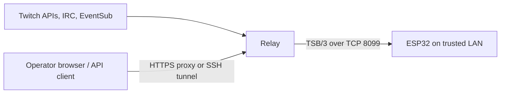

# 🛰️ Run the relay

[Guidebook](../README.md) · [Twitch application setup](twitch-app-setup.md) · [Configuration reference](../reference/relay-configuration.md) · [HTTP API](../reference/http-api.md)

The relay is the always-on middle of your setup: it receives Twitch activity, builds notifications and statistics, and pushes them to the ESP32. Run it on a computer or Linux host that your display can reach over Wi-Fi. Start in simulated mode, then connect Twitch once the device path works. Tiny screen, sensible infrastructure. ✨

## Choose your route 🚦

| Route | Best fit | What you install |
|---|---|---|
| [Native development](#native-development-) | Editing or debugging the relay | Git, a Java bootstrap runtime, curl, OpenSSL; Python 3 for the password helper |
| [Docker Compose](#docker-compose-) | An unattended local relay | Git, Docker Engine/Desktop with Compose v2, OpenSSL |
| [Standalone JAR](#standalone-jar-) | An existing JVM service host | Java 25 to run; the repository's Mill wrapper to build |

The [first simulated stream tutorial](first-simulated-stream.md) gives a shorter learning path. This page covers configuration, persistence, and ongoing operation.

## Native development 💻

Start from the repository root:

```sh
cd twitch-screen-relay
export RELAY_HTTP_AUTH_API_TOKEN="$(openssl rand -hex 32)"
export RELAY_TWITCH_MODE=simulated
./mill run
```

The checked-in launcher pins Mill **1.1.9**, Scala **3.9.0**, and Temurin **25** in [build.mill](../../twitch-screen-relay/build.mill). It downloads the pinned toolchain and dependencies on first use, so allow internet access and extra startup time. A current bootstrap Java runtime on `PATH` avoids launcher setup surprises; using JDK 25 directly is the straightforward option.

The token generation creates a fresh random management credential for this shell. Store it in a password manager for reuse. Running the command again rotates it **only after restarting the relay** with the new value. Other terminals must use the value the running relay received; generating a different token there will produce `401` responses.

Wait for startup logs announcing both listeners:

| Listener | Default | Connects from |
|---|---|---|
| Management HTTP and Swagger | `http://localhost:8080` and `/docs` | Your browser, terminal, and monitoring |
| TSB/3 device TCP | Port `8099` | ESP32 firmware |

In another terminal, confirm the public endpoints:

```sh
curl --fail --silent --show-error http://localhost:8080/api/v1/health
curl --fail --silent --show-error http://localhost:8080/api/v1/stats
```

Health returns `{"status":"Up"}`. Stats contains the latest broadcast state and counters. Public health confirms HTTP liveness; it does not require an attached device or working Twitch authorization.

For private readiness, use the **same management token** in this terminal:

```sh
curl --fail --silent --show-error \
  -H "Authorization: Bearer $RELAY_HTTP_AUTH_API_TOKEN" \
  http://localhost:8080/api/v1/status
```

Stop the native process with **Ctrl+C**. The relay shuts down its listeners and device sessions; devices reconnect when it returns.

## Keep local configuration private 🔐

The native launcher does **not** automatically read a `.env` file. Use exported variables or explicitly source a private shell file that you created and trust.

From `twitch-screen-relay/`, create a file with private permissions:

```sh
umask 077
touch .env.local
chmod 600 .env.local
```

Edit `.env.local` locally and add your settings, replacing the placeholder token with the output of `openssl rand -hex 32`:

```sh
RELAY_HTTP_AUTH_API_TOKEN='replace-with-a-random-private-token'
RELAY_TWITCH_MODE='simulated'
RELAY_CHAT_NOTIFICATIONS='hide'
```

Load it and run:

```sh
set -a
. ./.env.local
set +a
./mill run
```

`set -a` exports the assignments for the relay process; `set +a` restores normal shell behavior. Sourcing executes shell syntax, so only load a file you control. `.env*` files are ignored by this repository, except designated example templates. Credentials should stay outside version control and screenshots.

Changing an environment file does not reconfigure a running relay. Stop it, load the file, and start again. `GET /api/v1/config` shows the resolved settings with designated secrets masked.

### Add browser-friendly Basic authentication

From `twitch-screen-relay/`:

```sh
export RELAY_HTTP_AUTH_BASIC_USERNAME='admin'
export RELAY_HTTP_AUTH_BASIC_PASSWORD_HASH="$(python3 tools/hash_management_password.py)"
```

Start or restart the relay with both variables. The helper asks for a password of at least 12 characters and emits a PBKDF2-SHA256 verifier. Save the verifier in your private environment file **inside single quotes** so its `$` characters remain literal. The plaintext password is what you enter into the browser or a `curl --user admin` prompt.

Either Basic or Bearer authentication is enough for a protected request. Configuring both methods is supported. A partial Basic configuration still prevents startup, even when a valid Bearer token is configured.

## Docker Compose 🐳

From the repository root:

```sh
cd twitch-screen-relay
export RELAY_HTTP_AUTH_API_TOKEN="$(openssl rand -hex 32)"
docker compose up --build -d
docker compose ps
docker compose logs --tail=100 relay
```

The supplied [Compose file](../../twitch-screen-relay/compose.yaml) starts **simulated** mode and publishes host ports **8080** and **8099**. Its authentication variables are taken from your exported environment or Compose `.env` interpolation. Save the same token privately before returning later to restart the stack.

The image uses Temurin 25, runs as the unprivileged `relay` user, and stores Twitch authorization under `/home/relay/data`. Compose mounts this directory as the `relay-data` named volume; Docker prefixes its actual name with the Compose project name. Keep the same project name and volume when updating.

The starting container memory limit is **512 MiB**. `JAVA_OPTS` gives the heap up to 70% of container memory and exits on heap exhaustion. This is a starting budget exercised by the repository's container smoke check; measure your own stream/device workload before treating it as a capacity guarantee.

Useful operations, run from `twitch-screen-relay/`:

| Command | Result |
|---|---|
| `docker compose logs --follow relay` | Follow startup and runtime logs |
| `docker compose restart relay` | Restart with the existing container configuration |
| `docker compose up --build -d` | Rebuild and recreate as needed, preserving the named volume |
| `docker compose stop` | Stop containers and retain them and the data volume |
| `docker compose down` | Remove the stack's containers/network; retain its named volume |

Do not add `--volumes` to `down` when you want to retain saved Twitch consent. A plain `restart` does not apply changed environment variables; use `up -d` to recreate the service with its updated configuration.

### Run live Twitch in Compose

The base file hardcodes `RELAY_TWITCH_MODE: simulated`. Merely exporting `RELAY_TWITCH_MODE=live` does not override that YAML value. Create an override file that explicitly changes it.

First complete [Twitch app registration](twitch-app-setup.md). Then create a private `.env.live` in `twitch-screen-relay/`, with real values in place of the placeholders:

```dotenv
RELAY_HTTP_AUTH_API_TOKEN=replace-with-your-existing-random-management-token
RELAY_TWITCH_CHANNEL=yourchannel
RELAY_TWITCH_CLIENT_ID=replace-with-your-client-id
RELAY_TWITCH_CLIENT_SECRET=replace-with-your-client-secret
RELAY_TWITCH_REDIRECT_URL=http://localhost:8080/api/v1/twitch/callback
```

Create `compose.live.yaml` alongside `compose.yaml`. This file contains variable references, not credentials:

```yaml
services:
  relay:
    environment:
      RELAY_TWITCH_MODE: live
      RELAY_TWITCH_CHANNEL: ${RELAY_TWITCH_CHANNEL:?Set your channel login}
      RELAY_TWITCH_CLIENT_ID: ${RELAY_TWITCH_CLIENT_ID:?Set your client ID}
      RELAY_TWITCH_CLIENT_SECRET: ${RELAY_TWITCH_CLIENT_SECRET:?Set your client secret}
      RELAY_TWITCH_REDIRECT_URL: ${RELAY_TWITCH_REDIRECT_URL:-http://localhost:8080/api/v1/twitch/callback}
      RELAY_TWITCH_EVENTSUB_TRANSPORT: websocket
```

Run the combined configuration:

```sh
chmod 600 .env.live
docker compose --env-file .env.live -f compose.yaml -f compose.live.yaml up --build -d
docker compose --env-file .env.live -f compose.yaml -f compose.live.yaml logs --tail=100 relay
```

Use the same file arguments for future live updates. An exported variable in your shell can override `.env.live` interpolation, so keep those values consistent. Avoid pasting `docker compose config` output into issues: its resolved environment can contain secrets.

Complete the [Bearer consent flow](twitch-app-setup.md#5-start-the-relay-and-grant-consent-) from the browser computer, using an SSH tunnel for a headless host. For browser Basic login, add both Basic settings to `.env.live`; the base Compose file already forwards them. In Compose environment files, single-quote a saved PBKDF2 verifier to preserve its dollar signs.

### Persistence and backups

Only the Twitch token file is persistent application state here. Replay history, sequence state, logs, alerts, and activity are memory-resident and reset with the process. A volume backup preserves the grant; it does not turn the relay into a durable event archive.

Stop the relay before a token-volume backup, use your normal encrypted backup tooling, and protect restoration access as you would a password. Named volumes inherit the image's data-directory ownership. When choosing a bind mount instead, the directory must be writable by UID **10001**, the container's relay user.

## Standalone JAR 📦

Build from `twitch-screen-relay/`:

```sh
./mill assembly
```

Run the generated artifact with Java 25 and your exported configuration:

```sh
java -jar out/assembly.dest/out.jar
```

The token path remains relative to the process working directory. For an OS-managed service, choose a stable working directory, load secrets from a restricted environment file, restart on failure, and preserve the token directory across deployments. The repository does not ship a systemd unit or an automatic release installer.

## Network boundaries and HTTPS 🔒

The two listeners serve different audiences:



The ESP32 initiates the device connection; the arrow above shows the direction of pushed data. Set firmware `SERVER_HOST` to the relay's **LAN IP or resolvable hostname**, and `SERVER_PORT` to `8099`. `localhost` on the ESP32 refers to the ESP32, not your computer. Reserve the relay's LAN address in your router so a DHCP change does not strand the display.

The device TCP listener has **no authentication or TLS**. Keep port 8099 on a trusted LAN, with firewall access limited to the device network. Do not expose it directly to the internet. Network isolation matters even when the HTTP API has strong credentials.

The HTTP server itself speaks plain HTTP. Use an HTTPS reverse proxy or an SSH tunnel for credential-bearing requests across networks. The supplied Compose port mappings publish on all host interfaces by default; account for that in your firewall or change the HTTP mapping to `127.0.0.1:8080:8080` when a local proxy/tunnel is your only entry point. The container listener should still bind `0.0.0.0` internally.

A reverse proxy must preserve the public **Host** header. The relay does not trust forwarded headers for Basic-auth cross-site checks. Pass `Authorization` through to management routes. Preserve the exact OAuth and EventSub callback paths, and leave those callback routes reachable for their protocol-specific authentication. OAuth state protects the OAuth callback; HMAC verification protects webhook deliveries.

Health, aggregate stats, and Swagger documentation are intentionally public. Put access restrictions in your network/proxy when those should be private too. The current HTTP API is a single-operator management surface: it does not provide per-user roles, accounts, or tenant separation.

## Observe, update, recover 🧰

Use authenticated `/api/v1/status` for Twitch health, connected-device counts, dropped internal-bus events, and buffer/alert counts. `/api/v1/devices` adds per-connection traffic counters; `/api/v1/logs` and `/api/v1/activity` help explain what happened. The [API reference](../reference/http-api.md) includes filters and sample requests.

OpenTelemetry exports are disabled unless configured. To send traces and metrics to an existing collector, from `twitch-screen-relay/`:

```sh
OTEL_TRACES_EXPORTER=otlp OTEL_METRICS_EXPORTER=otlp \
OTEL_EXPORTER_OTLP_ENDPOINT=http://collector:4317 ./mill run
```

Replace `collector` with a reachable collector hostname. Container deployments must explicitly forward these variables in their Compose environment. No collector, Grafana instance, or Prometheus endpoint is installed by this command.

For an update, stop the old process, retain configuration and token storage, build the selected revision, and start with the same environment. Check health, authenticated readiness, and a manual device notification afterward. Devices and relay must both speak **TSB/3**; older NDJSON firmware cannot connect to this relay. Missed notifications are replayed only while retained by the current process, with a 64-record buffer by default.

For a problem report, include the commit, runtime/OS, selected mode, redacted status, relevant logs, and whether a manual notification arrives. Leave out the environment file, authorization headers, and token JSON. Follow the [troubleshooting guide](troubleshooting.md) for symptoms and the [firmware setup guide](firmware-setup.md) for the other half of the connection.

Source trail: [Compose deployment](../../twitch-screen-relay/compose.yaml), [container image](../../twitch-screen-relay/Dockerfile), [configuration](../../twitch-screen-relay/resources/application.conf), [management authentication](../../twitch-screen-relay/src/twitchscreen/relay/http/ManagementAuth.scala), and [container smoke check](../../tools/smoke_container.py).
