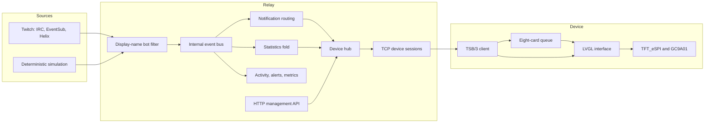
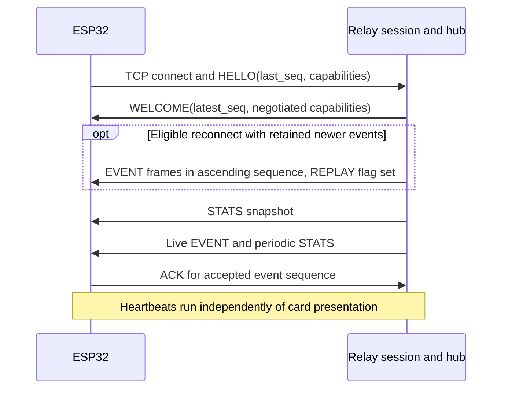

# Architecture

Twitch Screen separates internet integration from a small embedded display. A Scala relay ingests Twitch observations, keeps the current stream state, and sends compact binary frames to an ESP32. The ESP32 owns Wi-Fi, connection recovery, its card queue, and the 240 × 240 round interface. The CAD project supplies the enclosure and exported manufacturing files.

This page describes the implementation and the reasoning recorded in source comments, the normative protocol, and commit history. It does not introduce new architectural decisions or assign retrospective approval to undocumented alternatives. For a runnable introduction, start with [your first simulated stream](../guides/first-simulated-stream.md).

## System boundaries

| Boundary | Contract | Responsibility |
|---|---|---|
| Twitch → relay | IRC, Helix, EventSub via twitch4j | Translate provider observations into domain events and maintain authorization/recovery. |
| Inside relay | `RelayEvent` on a bounded event bus | Keep ingestion independent of cards, statistics, and diagnostics. |
| Operator → relay | HTTP `/api/v1`, default port 8080 | Configuration inspection, diagnostics, manual cards, device control, and live Twitch authorization. |
| Relay ↔ firmware | TSB/3 over device-initiated TCP, default port 8099 | Negotiate capabilities, push events and absolute statistics, heartbeat, report teardown, and attempt bounded replay. |
| Firmware → LCD | LVGL → TFT_eSPI → SPI | Render the local idle screen and notification cards. |
| CAD source → deliverables | `parameters.json` and Python geometry pipeline | Generate and validate enclosure solids, printable meshes, assemblies, and previews. |

The HTTP API and TSB/3 are separate interfaces. JSON sent to `/api/v1/notifications` is a management request, not a device wire frame. The device does not use HTTP or Twitch credentials. The former Python `demo-server` and its retirement notice have been removed; use the Scala relay's simulated mode for TSB/3 events.

## Relay assembly and lifetime

The relay uses Scala 3, Ox structured concurrency on JVM virtual threads, synchronous Tapir endpoints on Netty, PureConfig for HOCON configuration, jsoniter for JSON, and MacWire for compile-time wiring. Exact versions belong in [build.mill](../../twitch-screen-relay/build.mill).

[Dependencies.scala](../../twitch-screen-relay/src/twitchscreen/relay/Dependencies.scala) assembles the graph in dependency order. It creates the bus and hub, registers activity/alert/metric consumers, then installs notification routing and statistics aggregation before selecting a Twitch source. Registering consumers before producers prevents initial events from disappearing into an empty bus. It then creates the device listener and HTTP APIs.

[Main.scala](../../twitch-screen-relay/src/twitchscreen/relay/Main.scala) starts HTTP and then starts live ingestion. The live integration can therefore receive callbacks before registering subscriptions. The simulated source publishes its initial observations when it is created, after the consumers are registered; it does not need the live startup callback.

The application scope owns listeners, device sessions, consumers, and the live Twitch resources. [ApplicationLifetime](../../twitch-screen-relay/src/twitchscreen/relay/ApplicationLifetime.scala) gives the hub a bounded shutdown phase before cancelling that scope. The hub queues `SERVER_SHUTDOWN` BYE messages, permits device writers to drain for up to two seconds, and closes the sockets. This ordering matters because cancelling writers first would prevent an orderly goodbye from reaching a device.

## From a source observation to a card

[TwitchSource](../../twitch-screen-relay/src/twitchscreen/relay/twitch/TwitchSource.scala) chooses one of three implementations:

| Mode | Behavior | Required Twitch credentials |
|---|---|---|
| `disabled` | No Twitch ingestion; HTTP card publishing and device connections still work. | None. |
| `simulated` | Fixed scripts publish a stream-start observation, audience events, chat, and totals. | None. |
| `live` | twitch4j integrates IRC, Helix polling, and the selected EventSub transport. | Application credentials and, for scoped operations, a broadcaster user grant. |

The simulator and live source share the downstream bus, filter, routing, and aggregation. This is why simulated development exercises the production card path without needing a live account. Simulation does not prove that Twitch accepts the configured application or grant.

For live mode, IRC supplies chat, subscriptions, gifted subscriptions, cheers, and raids. EventSub handles follows, stream lifecycle, and channel updates. Helix supplies viewer, follower, and subscriber totals. The default EventSub transport is WebSocket; the webhook alternative has callback authentication and deduplication. See [Twitch application setup](../guides/twitch-app-setup.md) for its authorization and network prerequisites.

[BotFilter](../../twitch-screen-relay/src/twitchscreen/relay/twitch/BotFilter.scala) rejects configured display names before publication. Matching uses trimmed, lowercase **display names**, not Twitch user IDs or logins. This early placement prevents a filtered account from consuming bus capacity, a sequence number, a replay slot, or chat statistics. Display-name changes can therefore change whether a sender is filtered.

[NotificationRouter](../../twitch-screen-relay/src/twitchscreen/relay/device/NotificationRouter.scala) maps audience observations to structured `EventRequest` values. A person goes in `actor`, their message in `text`, and event-specific counts and tiers remain numeric. For example, a raid retains its viewer count instead of burying it in a sentence. Bits are a count; the current integration has no donation source or monetary values.

Manual HTTP notification requests enter the hub directly. They supply generic title/body content and a display duration, even when the request names an audience or lifecycle kind. Posting a card is not equivalent to observing a Twitch event: a manually posted follow does not update follower totals, and a manually posted stream-start card does not change the observed stream state.

## Statistics and lifecycle ordering

[StatsState](../../twitch-screen-relay/src/twitchscreen/relay/stats/StatsState.scala) folds observations into a value: offline/live state, viewers, followers, subscribers, recent chat timestamps, and the cumulative non-bot chat count. The current totals come from observations; a follow card does not itself increment the follower total.

The cumulative message count resets when a stream starts and remains available after a stream ends. Chat rate uses a one-minute sliding window by default. Hiding chat cards does not suppress either count because visibility is decided later, at device delivery.

[StatsAggregator](../../twitch-screen-relay/src/twitchscreen/relay/stats/StatsAggregator.scala) merges events and timer ticks into one stateful flow, avoiding shared mutable state between those inputs. It normally publishes every five seconds. Stream start and end are special: the resulting lifecycle card and its updated statistics pass through one hub operation, so the device receives the event followed by the corresponding snapshot. This prevents a new lifecycle card from being followed by stale state from before that transition.

The wire `STATS` payload is an absolute snapshot. A missed earlier frame does not need to be reconstructed before the next snapshot makes sense. `GET /api/v1/stats` exposes a summary of the hub's latest statistics: state, viewers, followers, subscribers, uptime, and chat rate. It does not expose every wire field, including the cumulative message count.

## Concurrency and bounded memory

The relay has two distinct ordering boundaries.

- [EventBus](../../twitch-screen-relay/src/twitchscreen/relay/bus/EventBus.scala) gives every subscriber its own bounded queue and worker. A slow subscriber loses events once its queue fills; it cannot stop Twitch ingestion or another consumer. Concurrent producers have no global ordering guarantee on the bus. `/api/v1/status` exposes delivery and drop counters per subscriber.
- [DeviceHub](../../twitch-screen-relay/src/twitchscreen/relay/device/DeviceHub.scala) serializes device attachment, sequence assignment, replay storage, and outbound publication in an actor. Device-visible sequence order is established here. The actor offers messages without blocking; session writers encode and write frames outside it.

Encoding per session keeps the hub independent of slow sockets and permits a per-device text policy. The current firmware does not advertise `CAP_UTF8_TEXT`; the relay applies its wire text policy accordingly. That is separate from the UTF-8 JSON management interface.

The default capacities are explicit and finite:

| Resource | Default or fixed limit | Full-capacity behavior |
|---|---:|---|
| Internal bus subscriber queue | 1,024 events | That subscriber drops further offers and increments its drop counter. |
| TCP sessions, including handshakes | 64 | Additional accepted sockets are closed. |
| Per-device outbound queue | 128 frames | An event delivery gap closes that device connection; replaceable statistics can be dropped. |
| Non-chat replay ring | 64 events | Oldest records are evicted. |
| Chat replay ring | 16 events | Oldest chat records are evicted without evicting non-chat records. |
| Firmware card queue | 8 cards | Pauses EVENT consumption until a slot frees; defensive refusal preserves the accepted sequence and reconnects. |
| Activity history | 500 entries | Retains a bounded recent history. |
| Alert history | 100 entries | Retains a bounded alert history. |
| Log history | 500 records | Retains a bounded recent log tail. |

Configuration defaults are in [application.conf](../../twitch-screen-relay/resources/application.conf); protocol limits and invariants are in [PROTOCOL.md](../../twitch-screen-firmware/docs/PROTOCOL.md). A protected diagnostic request can reveal a dropped-event condition, but diagnostics do not turn these bounded queues into durable storage.

## Reconnects and delivery limits

The [TSB/3 specification](../../twitch-screen-firmware/docs/PROTOCOL.md) is the authoritative contract for both independent implementations. It defines fixed-offset little-endian payloads, an eight-byte checked header, a 256-byte maximum frame, and explicit handshake/refusal behavior. Fixed records make field layout unambiguous across Scala and C++; absolute telemetry makes a captured snapshot useful when diagnosing the screen.

On a fresh boot, the device sends `last_seq = 0`. It baselines to the relay's current sequence and receives no historical backlog. A reconnect with `0 < last_seq <= latest_seq` is eligible for retained events newer than that mark, subject to device capabilities and chat policy. A device ahead of the relay's current sequence rebaselines. The random relay session ID is diagnostic; it is not a persistent recovery identity.

The device's sequence mark tracks **accepted cards**, not cards already shown. An ACK therefore does not prove that a viewer saw a notification. While the queue is full, the link pauses EVENT consumption so queued cards can finish rendering. If queue admission nevertheless refuses a card, the firmware preserves the earlier accepted cards and high-water mark and reconnects for a replay attempt.

Replay is best effort within finite memory. Evicted events are lost; a device reboot loses its queue; a relay restart loses its rings and sequence state. After a restart, a numeric sequence overlap cannot establish that the device and relay refer to the same old event history. TSB/3 does not provide durable delivery or an end-to-end exactly-once guarantee.

The relay maintains one active connection per claimed device ID, reclaiming an older session when that ID reconnects and bounding repeated reclaims. IDs are not credentials. The TCP link has no TLS or cryptographic device authentication and belongs on a trusted network. HTTP management authentication protects a different boundary and does not secure port 8099.

## Firmware ownership and rendering

[main.cpp](../../twitch-screen-firmware/src/main.cpp) runs LVGL pumping, connection progress, queue consumption, and card presentation on the Arduino loop. Display callbacks remain on that loop. The transport adapter handles platform-specific network work; the transport-independent [link_client.cpp](../../twitch-screen-firmware/src/link_client.cpp) can also run in native tests with a controlled transport.

The receive path is a resumable parser with fixed buffers and per-loop work budgets. The display continues to pump during connection attempts and partial network frames. The notification queue and presentation helpers are separately testable without Arduino or an LCD.

[lv_port.cpp](../../twitch-screen-firmware/src/lv_port.cpp) uses one static 19,200-byte partial draw buffer: 240 pixels × 40 lines × two bytes. LVGL renders swapped RGB565 for the GC9A01's SPI byte order; flushing is synchronous through TFT_eSPI. This concrete arrangement is why changes to color format or SPI transfer ownership need physical display checks as well as compilation.

The idle UI displays connection and stream state plus statistics. The card UI displays one accepted notification at a time for its assigned duration before advancing the queue. A locally ticking uptime label is re-anchored by incoming statistics snapshots. Rendering tests on a host do not establish the panel's colors, wiring, Wi-Fi behavior, or watchdog behavior on a board.

## Management, observability, and persistence

Management endpoints require configured Basic authentication or a Bearer token, including in simulated and disabled modes. Missing or invalid credential configuration fails startup. Health, aggregate statistics, and Swagger UI are public. Live OAuth and EventSub callbacks use their own state/signature checks. [Http](../../twitch-screen-relay/src/twitchscreen/relay/http/Http.scala) classifies each endpoint; [ManagementAuth](../../twitch-screen-relay/src/twitchscreen/relay/http/ManagementAuth.scala) refuses unclassified endpoints during assembly.

Health is deliberately a liveness check. It stays useful when Twitch is unavailable; the richer protected status endpoint reports component health, connected devices, queue drops, and diagnostic counts. Alert acknowledgement records that an operator has seen an alert; it does not make an unresolved condition disappear. OpenTelemetry configuration is supplied through standard `OTEL_*` environment variables. The application installs context propagation for its virtual-thread work so traces and log context can remain connected.

| State | Location | Survives process or device restart? |
|---|---|---|
| Relay configuration | HOCON defaults and process environment | Only through the configuration supplied on the next start. |
| Twitch access and refresh tokens | Configured token file; `data/twitch-token.json` by default | Yes, while that file persists; Compose mounts its directory in `relay-data`. |
| Card replay, sequence counter, stream statistics | Relay memory | No. |
| Activity, alerts, buffered logs | Relay memory | No; external log or telemetry collection is separate. |
| Firmware Wi-Fi and relay settings | Ignored `credentials.h`, compiled into the firmware | Yes, as part of the flashed image. |
| Firmware accepted-card queue and sequence mark | Device memory | No. |
| Enclosure design and exported models | CAD source and versioned `output/` | Yes, as repository files. |

See [relay setup](../guides/relay-setup.md) for configuration and [troubleshooting](../guides/troubleshooting.md) for the observation sequence used to diagnose failures.

## Mechanical project and recorded design context

The enclosure is an independent parametric FreeCAD project. [parameters.json](../../twitch-screen-cad-design/parameters.json) feeds geometry and document creation; export, validation, rendering, and packaging are separate scripts. Versioned STEP, STL, 3MF, FCStd, and preview files let a reader inspect the design without running the CAD toolchain. The release manifest, gallery, and delivery ZIP are generated packaging artifacts.

The model's source layout is part of its recompute contract: scripts locate the project by their path depth, and stored FreeCAD proxies refer to `pod_document`. Moving or renaming those modules can leave an existing document readable but unable to recompute. Nominal geometry checks and sampled assembly clearances do not establish tolerances against a printed part or a particular board clone. See [device build](../guides/device-build.md) and the [CAD README](../../twitch-screen-cad-design/README.md).

The repository already records design rationale rather than a separate ADR series:

- [Protocol section 1](../../twitch-screen-firmware/docs/PROTOCOL.md#1-decisions-taken-from-the-design-review) records the binary record layout, absolute statistics, sequencing, and unsupported monetary fields.
- Commit `eb00a94` replaced NDJSON v2 with TSB/3 on both sides; the legacy demo remains retired.
- Commit `12a6737` paired lifecycle cards with their resulting statistics; `fd42e6a` added supervised Twitch recovery and serialized lifecycle transitions.
- Commit `a9cce0e` closed device connections before event gaps; `390a93f` ordered shutdown so writers can drain before application cancellation.
- [Review status](../../tasks/review-status.md) and [validation evidence](../../tasks/review-judge.md) record the remaining boundaries of exercised behavior.

Future decisions can be documented when they are made, with their actual alternatives and consequences. Existing source comments and history should remain evidence rather than being rewritten as new decisions.

Continue with [development and verification](../guides/development.md), or return to the [guidebook](../README.md).
