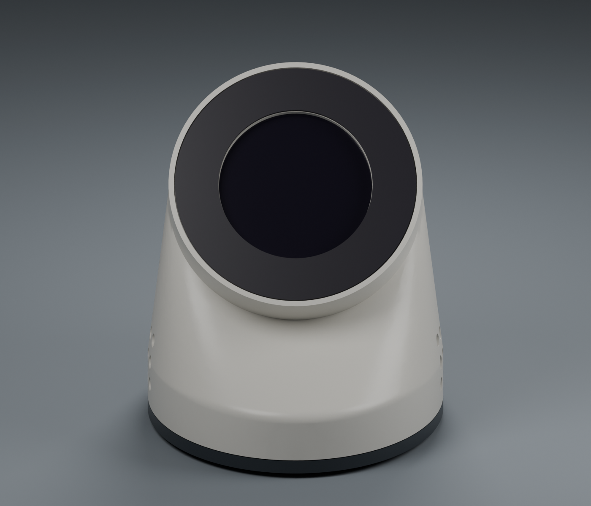

<div align="center">

<h1>⚡ Twitch Screen · Firmware</h1>

<p><strong>240 × 240 pixels. A surprising amount of personality.</strong></p>
<p>ESP32 · Arduino · TFT_eSPI · LVGL 9 · TSB/3</p>

<p>
  <a href="../docs/guides/firmware-setup.md">Flash your device</a> ·
  <a href="../docs/guides/device-build.md">Wiring & build</a> ·
  <a href="../docs/guides/device-use.md">Daily use</a> ·
  <a href="../docs/README.md">Guidebook</a>
</p>



<p><em>CAD visualization of the enclosure; physical fit remains to be validated.</em></p>

</div>

This firmware turns a classic ESP32 DevKit V1 and Waveshare GC9A01 LCD into an always-on stream dashboard. The [relay](../twitch-screen-relay/README.md) sends telemetry and notifications over persistent TCP; the device handles its own presentation, queue and reconnect loop. Your desk gets a tiny hype department. 💜

## ✨ What runs on the screen

- Animated **CONNECTING**, **OFFLINE** and **LIVE** states.
- Viewer count, stream uptime, follower/subscriber totals and observed chat total.
- A chat-activity ring and event cards for follows, subs, gifts, raids, Bits, chat and stream transitions.
- Automatic retries and bounded replay after connection interruptions.
- Custom INFO, MESSAGE, WARNING and ALERT cards supplied by the relay.

The current build has no touch/menu input, on-device provisioning, PWM brightness setting or OTA updater. Wi-Fi and relay settings are compiled in; USB is the update path. [Daily use](../docs/guides/device-use.md) explains timing, ASCII text support and recovery limits.

## 🚀 Quick start

From the **repository root**, install the pinned CLI and create the private header without replacing an existing one:

```sh
python3 -m venv .venv-pio
.venv-pio/bin/python -m pip install platformio==6.1.18
cd twitch-screen-firmware
if [ ! -e src/credentials.h ]; then
  cp src/credentials.example.h src/credentials.h
fi
```

Edit `src/credentials.h`: enter your Wi-Fi credentials, the relay computer's **LAN address**, TCP port `8099`, and optionally a unique device name. Leave `DEVICE_ID` empty for an automatic chip-derived identity. Do not commit this header or share a firmware binary containing your private settings.

Run these commands sequentially from `twitch-screen-firmware/`:

```sh
../.venv-pio/bin/pio test -e native
../.venv-pio/bin/pio test -e native-sanitized
../.venv-pio/bin/pio run -e esp32dev
```

The sanitizer target is configured for Linux. Once the correct device is connected, upload and inspect it:

```sh
../.venv-pio/bin/pio run -e esp32dev -t upload
../.venv-pio/bin/pio device monitor
```

The monitor uses 115200 baud. Close it before another upload. For explicit port selection, OS setup and BOOT-button recovery, use the complete [firmware setup guide](../docs/guides/firmware-setup.md).

Before first boot, start the [LAN-reachable simulated relay](../docs/guides/firmware-setup.md#start-a-relay-the-physical-device-can-reach) and leave it running. The [first simulated stream tutorial](../docs/guides/first-simulated-stream.md) is a separate local exercise whose loopback-only listener cannot accept a physical ESP32. Management authentication is required even in simulated mode. The old Python/NDJSON demo is incompatible with TSB/3.

## 🔌 Wiring

Disconnect power before changing connections.

| LCD | ESP32 label | GPIO |
| --- | --- | --- |
| VCC | 3V3 | — |
| GND | GND | — |
| DIN | D23 | 23 |
| CLK | D18 | 18 |
| CS | D5 | 5 |
| DC | RX2 | 16 |
| RST | D4 | 4 |
| BL | D15 | 15 |

The authoritative configuration is in [platformio.ini](platformio.ini): GC9A01, 240 × 240, 40 MHz SPI, `huge_app.csv`, pinned libraries and compiler flags. TFT_eSPI receives its setup through those flags; there is no library `User_Setup.h` to edit.

## 🧭 Source map

| File | Responsibility |
| --- | --- |
| [main.cpp](src/main.cpp) | Arduino setup/loop, queue admission and display dispatch |
| [link_client.cpp](src/link_client.cpp) | Transport-independent TSB/3 session, deadlines and retry state |
| [link_transport_esp32.cpp](src/link_transport_esp32.cpp) | ESP32 Wi-Fi, DNS and nonblocking TCP integration |
| [proto_codec.cpp](src/proto_codec.cpp) | Bounded binary encoder, decoder and stream framing |
| [notify_queue.h](src/notify_queue.h) | Eight-entry waiting queue, replay position and admission policy |
| [notification_wire.h](src/notification_wire.h) | Protocol fields converted into display notifications |
| [lv_port.cpp](src/lv_port.cpp) | LVGL/TFT bridge; one 19,200-byte synchronous partial draw buffer |
| [ui_idle.cpp](src/ui_idle.cpp) / [ui_notify.cpp](src/ui_notify.cpp) | Dashboard states and notification cards |
| [presentation.h](src/presentation.h) | Compact counts and readable chat colors |
| [include/lv_conf.h](include/lv_conf.h) | Project LVGL configuration |
| [test/](test/) | Host codec, queue, session, presentation and parser regressions |
| [tools/build_version.py](tools/build_version.py) | Source commit identifier embedded in the device greeting |

LVGL and application callbacks remain on the Arduino loop. Network work must keep that loop responsive. When the queue is full, event consumption pauses; defensive refusal reconnects before a later sequence can cross the gap. ACK reports queue admission, not completed on-screen presentation.

## 🧪 Verification and limits

From the repository root:

```sh
python3 tools/check_protocol_vectors.py
```

This checks the shared normative protocol vectors. Native tests and an ESP32 compile establish software results; they do not establish physical LCD rendering, Wi-Fi outage recovery or watchdog behavior on hardware. Record those observations separately after any upload.

PlatformIO commands share a package store: do not run installs/builds concurrently. If an old global virtual environment stops importing PlatformIO after a Python update, use the isolated setup above.

## 📚 Keep exploring

- [TSB/3 specification](docs/PROTOCOL.md) — the normative wire contract and finite replay guarantees.
- [Hardware build guide](../docs/guides/device-build.md) — parts, printing, wiring and assembly.
- [Troubleshooting](../docs/guides/troubleshooting.md) — display colors, upload failures and connection logs.
- [Relay setup](../docs/guides/relay-setup.md) and [Twitch application setup](../docs/guides/twitch-app-setup.md).
- [PLAN.md](PLAN.md) — historical design notes and roadmap; some earlier status entries predate the current relay and enclosure.
- [Project overview](../README.md).
