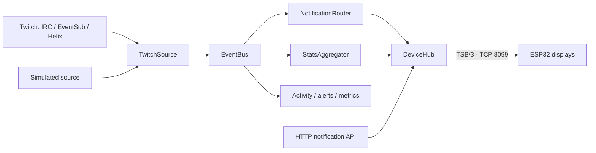

<div align="center">

# 🛰️ twitch-screen-relay

**Your stream's backstage crew. Your tiny screen's very chatty friend.**

Twitch activity → Scala relay → TSB/3 → ESP32 desk display ✨

[🏠 Project overview](../README.md) · [📚 Guidebook](../docs/README.md) · [🎮 Connect Twitch](../docs/guides/twitch-app-setup.md) · [🔌 HTTP API](../docs/reference/http-api.md)

</div>

The relay watches a Twitch channel, turns activity into notification cards and live stats, and pushes them to ESP32 displays over persistent TCP. It also provides an authenticated management API, a simulator, diagnostics, and Swagger UI.

Built with **Scala 3**, **Ox**, synchronous **Tapir/Netty**, **jsoniter-scala**, **PureConfig**, **MacWire**, and **Twitch4J**. Versions are pinned in [build.mill](build.mill); the stack follows the [VirtusLab Scala Stack](https://vss.virtuslab.com/) approach.

## 🚀 First run: no Twitch account required

From this directory:

```sh
export RELAY_HTTP_AUTH_API_TOKEN="$(openssl rand -hex 32)"
RELAY_TWITCH_MODE=simulated ./mill run
```

The launcher downloads the pinned Mill **1.1.9** and Temurin **25** toolchain on first use. Keep the generated management token privately; other terminals must use that same value. Management authentication is required in all modes.

Open **`http://localhost:8080/docs`** for Swagger UI. Check liveness:

```sh
curl --fail --silent --show-error http://localhost:8080/api/v1/health
```

Expected: `{"status":"Up"}`. The simulator produces a repeating stream of events, even with no device attached. Set firmware `SERVER_HOST` to this machine's LAN address and `SERVER_PORT` to **8099** to connect the display.

Send your first card from a terminal with the same token:

```sh
curl --fail --silent --show-error \
  -H "Authorization: Bearer $RELAY_HTTP_AUTH_API_TOKEN" \
  -H 'Content-Type: application/json' \
  --data '{"type":"info","title":"Hello, tiny world","body":"The desk lore begins."}' \
  http://localhost:8080/api/v1/notifications
```

Want the guided version? Start with [your first simulated stream](../docs/guides/first-simulated-stream.md), then [run the relay](../docs/guides/relay-setup.md).

## 🎛️ Pick a mode

| Mode | What happens | Twitch credentials |
|---|---|---|
| `disabled` | Manual API notifications and device services | None |
| `simulated` | Synthetic follows, subs, gifts, raids, Bits, chat, totals, and an initial stream-start event | None |
| `live` | Real Twitch Helix, IRC, and EventSub integration | Client ID/secret, then broadcaster consent |

The native default is `disabled`; the supplied Compose file uses `simulated`. Chat cards default to **hidden** so follows and raids can have their moment. Accepted chat still contributes to counters.

## 🎮 Connect your channel

Use the [complete Twitch setup guide](../docs/guides/twitch-app-setup.md) to register a **Confidential** app, set the exact callback, configure live mode, and grant consent as the broadcaster. The relay resolves the broadcaster's numeric ID from the channel login.

The default callback is `http://localhost:8080/api/v1/twitch/callback`. Start consent at the **management-protected** `/api/v1/twitch/authorize`; use Basic browser login or obtain the redirect with a Bearer-capable client. Tokens are saved in `data/twitch-token.json`, refreshed before expiry, and validated periodically. The ESP32 never stores Twitch credentials.

Default EventSub delivery uses an outbound **WebSocket**, which suits a home LAN. Webhooks are also supported with a public HTTPS callback. Live event sources are deliberately split:

| Source | Responsibility |
|---|---|
| Anonymous IRC | Chat, subscriptions, gifts, Bits, raids |
| EventSub | Follows, stream online/offline, channel updates |
| Helix polling | Viewer, follower, and subscriber totals |

Default scopes are `moderator:read:followers` and `channel:read:subscriptions`. IRC event types are not backed up by EventSub subscriptions in this version. Real-account provider acceptance and sustained recovery still require validation with actual Twitch credentials.

## 🧠 How it fits together



`DeviceHub` serializes sequence allocation and retains two bounded replay rings: **64 non-chat notifications** by default and **16 chat notifications**. A reconnect can replay retained events; relay restarts reset that history. TSB/3 provides best-effort replay, not durable delivery.

Internal consumers have bounded queues so slow diagnostics cannot stall Twitch ingestion. Per-device backpressure protects event ordering: a failed event enqueue closes the affected connection before later events can pass it; stats frames may be dropped. Device sessions and workers live inside the application lifetime managed by Ox.

The binary [TSB/3 specification](../twitch-screen-firmware/docs/PROTOCOL.md) defines the shared contract. NDJSON v2 peers cannot connect. Device TCP trusts the LAN and has **no authentication or TLS**; keep it private.

## 🐳 Docker, persistence, and configuration

From this directory, with your management token exported:

```sh
docker compose up --build -d
docker compose logs --tail=100 relay
```

Compose publishes ports **8080** and **8099**, starts simulated mode, sets a **512 MiB** starting memory budget, and persists the token directory in a named volume. See [relay deployment](../docs/guides/relay-setup.md) for live-mode overrides, private environment files, backups, HTTPS, and headless consent.

Common settings:

| Variable | Default | Purpose |
|---|---|---|
| `RELAY_HTTP_AUTH_API_TOKEN` | None | Management Bearer credential; Basic is an alternative |
| `RELAY_HTTP_PORT` | `8080` | Management listener |
| `RELAY_DEVICE_PORT` | `8099` | ESP32 TCP listener |
| `RELAY_TWITCH_MODE` | `disabled` | Select source |
| `RELAY_CHAT_NOTIFICATIONS` | `hide` | Show/hide individual chat cards |
| `RELAY_NOTIFICATION_TTL` | `8 seconds` | Default duration for manually posted cards |
| `RELAY_STATS_INTERVAL` | `5 seconds` | Device dashboard push cadence |

The [complete configuration reference](../docs/reference/relay-configuration.md) distinguishes environment overrides from advanced HOCON settings. Config is read at startup; authenticated `GET /api/v1/config` shows effective values with secrets masked. OpenTelemetry exports are opt-in through standard `OTEL_*` variables.

## 🔌 Your control room

| Endpoint | Use |
|---|---|
| `GET /api/v1/health` | Public HTTP liveness |
| `GET /api/v1/stats` | Public aggregate stats |
| `GET /api/v1/status` | Authenticated integration/device readiness |
| `GET /api/v1/devices` | Device identities and traffic diagnostics |
| `POST /api/v1/notifications` | Publish a card to all connected displays |
| `GET /api/v1/activity`, `/alerts`, `/logs` | Recent activity and operational diagnostics |

Swagger is at `/docs`. The [HTTP API reference](../docs/reference/http-api.md) covers every route, authentication, filters, response contracts, and the current stream-kind JSON spelling limitation. Notification POST returns **200**; retries can publish duplicates.

Use an HTTPS proxy or SSH tunnel for management requests across networks. The relay requires at least one valid Basic or Bearer method; health, stats, documentation, and protocol-validated callbacks remain public.

## 🧑‍💻 Developer commands

Run these from `twitch-screen-relay/`:

| Command | Purpose |
|---|---|
| `./mill compile` | Compile with warnings treated as errors |
| `./mill test` | MUnit suites, including HTTP and real-socket regressions |
| `./mill test.testOnly twitchscreen.relay.http.ApiSuite` | Focused HTTP API suite |
| `./mill run` | Start with the current environment |
| `./mill assembly` | Build `out/assembly.dest/out.jar` |
| `./mill mill.scalalib.scalafmt/` | Format Scala sources |
| `./mill mill.scalalib.scalafmt/checkFormatAll` | Check formatting |

Run repository-wide checks from the repository root:

```sh
python3 tools/check_protocol_vectors.py
python3 tools/audit_relay_dependencies.py
docker build -t twitch-screen-relay:review twitch-screen-relay
python3 tools/smoke_container.py
```

The dependency audit uses OSV and fails on new advisories or incomplete scans. Existing exact exceptions expire on **2026-10-25**; see the [dependency assessment](../tasks/review-dependencies.md). The container smoke exercises the selected image under its memory budget, HTTP protection/redaction, TSB/3 handshake, and shutdown.

## 🗂️ Find your way around

| Location | Responsibility |
|---|---|
| `Main.scala`, `ApplicationLifetime.scala` | Entry point and application lifecycle |
| `Dependencies.scala`, `Apis.scala` | Dependency and endpoint assembly |
| `config/` | Typed configuration and validation |
| `protocol/` | TSB/3 types, frame readers, encoders/decoders |
| `device/` | TCP listener, sessions, replay hub, notification API |
| `twitch/` | Live/simulated/disabled sources, OAuth, IRC/EventSub/Helix adapters |
| `bus/`, `stats/` | Internal events and aggregate stream state |
| `activity/`, `alerts/`, `health/` | Operational state and diagnostics |
| `http/`, `observability/` | HTTP infrastructure, authentication, logging, telemetry |
| `test/src/` | Regression suites |

Paths are under `src/twitchscreen/relay/` unless stated otherwise. One small [Java factory](src/twitchscreen/relay/twitch/EventSubFactory.java) bridges Twitch4J's Lombok-generated builder types; the surrounding integration remains Scala.

Contributors should keep protocol changes coordinated with firmware, preserve direct-style resource ownership, and run relevant suites. Start with the [guidebook](../docs/README.md) and [protocol](../twitch-screen-firmware/docs/PROTOCOL.md). New endpoints declare public, callback, or management access explicitly; unclassified routes fail startup.
